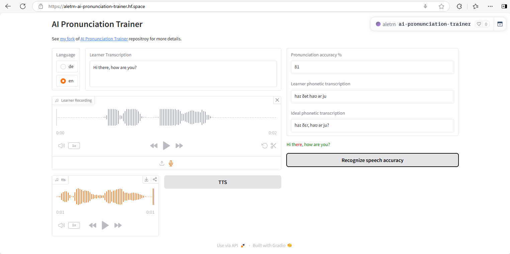

# AI Pronunciation Trainer

This repository refactor [Thiagohgl](https://github.com/Thiagohgl)'s [AI Pronunciation Trainer](https://github.com/Thiagohgl/ai-pronunciation-trainer) project, a tool that uses AI to evaluate your pronunciation so you can improve it and be understood more clearly.
You can try my [refactored version](https://github.com/trincadev/ai-pronunciation-trainer) both locally or online, using my [HuggingFace Space](https://huggingface.co/spaces/aletrn/ai-pronunciation-trainer):

[](https://aletrn-ai-pronunciation-trainer.hf.space/)

My [HuggingFace Space](https://huggingface.co/spaces/aletrn/ai-pronunciation-trainer) is a free of charge: for this reason is the less powerful version and the speech recognition could take some seconds.

## Installation

To run the program locally, you need to install the requirements and run the main python file.
These commands assume you have an active virtualenv (locally I'm using python 3.12, on HuggingFace the gradio SDK - version 5.6.0 at the moment - uses python 3.10):

```bash
pip install -r requirements.txt
python webApp.py
```

On Windows you can also use WSL2 to spin a Linux instance on your installation, then you don't need any particular requirements to work on it.
You'll also need ffmpeg, which you can download from here <https://ffmpeg.org/download.html>. You can install it on base Windows using the command `winget install ffmpeg`, it may be needed to add the ffmpeg "bin" folder to your PATH environment variable. On Mac, you can also just run "brew install ffmpeg".

You should be able to run it locally without any major issues as long as you’re using a recent python 3.X version.  

## Changes on [trincadev's](https://github.com/trincadev/) [repository](https://github.com/trincadev/ai-pronunciation-trainer)

Currently the best way to exec the project is using the Gradio frontend:

```bash
python app.py
```

I upgraded the old custom frontend (jquery@3.7.1, bootstrap@5.3.3) and backend (pytorch==2.5.1, torchaudio==2.5.1) libraries. On macOS intel it's possible to install from [pypi.org](https://pypi.org/project/torch/) only until the library version [2.2.2](https://pypi.org/project/torch/2.2.2/)
(see [this github issue](https://github.com/instructlab/instructlab/issues/1469) and [this deprecation notice](https://dev-discuss.pytorch.org/t/pytorch-macos-x86-builds-deprecation-starting-january-2024/1690)).

### E2E tests with playwright

Normally I use Visual Studio Code to write and execute my playwright tests, however it's always possible to run them from cli (from the `static` folder, using a node package manager like `npm` or `pnpm`):

```bash
pnpm install
pnpm playwright test
```

### Unused classes and functions (now removed)

- `aip_trainer.lambdas.lambdaTTS.*`
- `aip_trainer.models.models.getTTSModel()`
- `aip_trainer.models.models.getTranslationModel()`
- `aip_trainer.models.AllModels.NeuralTTS`
- `aip_trainer.models.AllModels.NeuralTranslator`

### DONE

- upgrade jquery>3.x
- upgrade pytorch>2.x
- e2e playwright tests
- add an updated online version (HuggingFace)
- refactor frontend moving from jquery to gradio

### TODO

- play the isolated words in the recordings, to compare the 'ideal' pronunciation with the learner pronunciation (now it's possible on the old frontend, complicated to implement with Gradio - waiting for [this](https://github.com/gradio-app/gradio/issues/9823))
- improve documentation (especially function docstrings), backend tests
- move from pytorch to onnxruntime (if possible)
- add more e2e tests with playwright

## Docker version

Build the docker image this way (right now this version uses the old custom frontend with jquery):

```bash
# clean any old active containers
docker stop $(docker ps -a -q); docker rm $(docker ps -a -q)

# build the base docker image
docker build . -f dockerfiles/dockerfile-base --progress=plain -t registry.gitlab.com/aletrn/ai-pronunciation-trainer:0.5.0

# build the final docker image
docker build . --progress=plain --name 
```

Run the container (keep it on background) and show logs

```bash
docker run -d -p 3000:3000 --name aip-trainer aip-trainer;docker logs -f aip-trainer
```

## Motivation

Often, when we want to improve our pronunciation, it is very difficult to self-assess how good we’re speaking. Asking a native, or language instructor, to constantly correct us is either impractical, due to monetary constrains, or annoying due to simply being too boring for this other person. Additionally, they may often say “it sounds good” after your 10th try to not discourage you, even though you may still have some mistakes in your pronunciation.

The AI pronunciation trainer is a way to provide objective feedback on how well your pronunciation is in an automatic and scalable fashion, so the only limit to your improvement is your own dedication.

This project originated from a small program that I did to improve my own pronunciation.  When I finished it, I believed it could be a useful tool also for other people trying to be better understood, so I decided to make a simple, more user-friendly version of it.

## Disclaimer

This is a simple project that I made in my free time with the goal to be useful to some people. It is not perfect, thus be aware that some small bugs may be present. In case you find something is not working, all feedback is welcome, and issues may be addressed depending on their severity.
